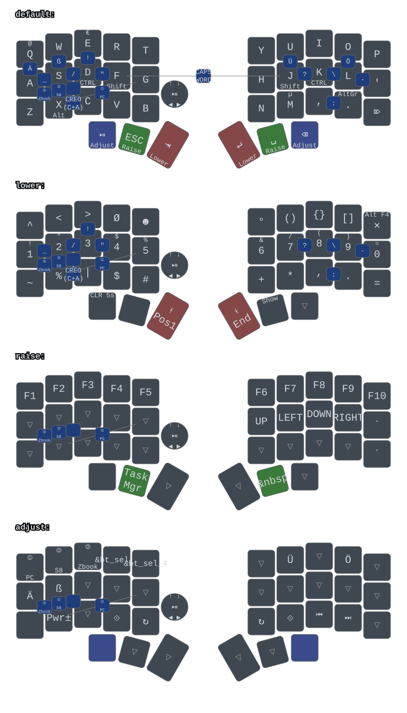

Firmware for Hawk handwired hotswap wireless 5x3+3 split mechanical ergo keyboard with two SuperMini nRF52840 controllers.  
Left Alps RKJXT1F42001 5-way encoder multiswitch.  
Left 'mechanical' BT-selector switch.
3D printed upper case half.
3D printed case bottom plate.
500mAh battery on each half mounted below the case bottom plate.
Moulded tin tenting weights under each half, total kb weight 1100g for both halves.

## Keymap
  

Basis for the layout was a testrig with five adjustable finger triplets and a thumb triplet for MX switches and keycaps. Once I was satisfied with the adjustment, I took the geometry as basis for the Hawk.

BT Selector internals.
Springs are 4mm diameter taken from MX blue switches out of an old Cherry G80, Pushrods for the TS09-63-25-WT-260-SMT-TR tactile SMD switches on top of the narrow PCB pressed in the pushbuttons and located inside the springs are cut to length bicycle spokes, double diodes on the bottom of the PCB are BAV70 type.

One contact of each selector SMD switch is wired to GND and the other to TWO keys each with BAV70 double diodes to save space. One of the keys is common to all four bushbuttons (X) and the others are differnt obviously (A, S, D and G). In ZMK they are processed as combos.

The Alps multiswitch is processed in a similar manner.

To mount the Alps multiswitch rigidly to the PLA top plate, a small PCB with four mounting holes is used.

Both Selector PCB (4 and 5 button type) and Alps mount PCB (round and rectangular type w/ matrix or direct-pin option) are produced on a less than 100x100mm PCB as one piece. [Gerber-file](./gerber/Gerber_Y4.zip)

For the tin tenting weights, first a PLA positive was printed for each side with space for batteries and BT-Selector, plaster/sand moulds formed and filled with molten tin. Final drill holes, some local machining and polishing was necessary to make the weights ready for assembly.

As there is enough space below the board in the tenting wedge, the board is powered by two 500mAh 3.7V 503035 Lipo Polymer Batteries.
